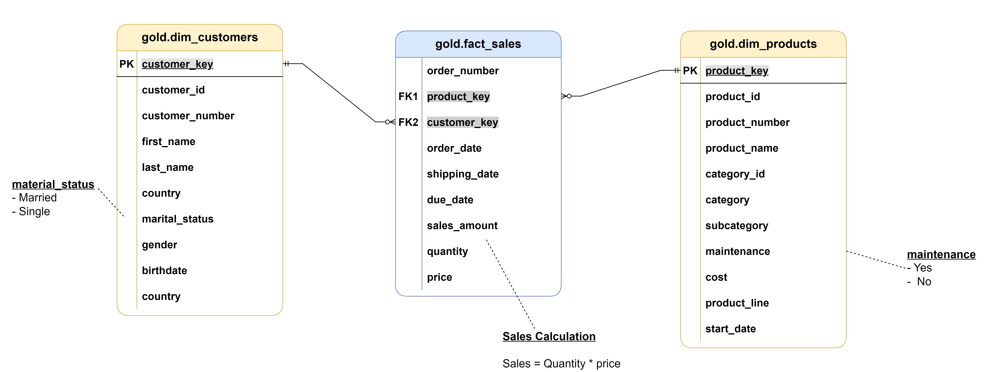

# 🏗️ Building a Modern Data Warehouse

> A hands-on data warehousing project following Baraa's comprehensive Udemy course — implementing a full end-to-end pipeline from raw data ingestion to analytical reporting using SQL Server, Power BI, and industry-standard data modeling practices.

---

## 📖 Project Overview

This project demonstrates the complete lifecycle of a modern data warehouse, built from scratch using the **Medallion Architecture** (Bronze → Silver → Gold layers). It covers data ingestion, cleansing, transformation, star schema modeling, and business analytics — simulating real enterprise scenarios.

The project is based on the Udemy course:
**"Data Warehouse Fundamentals: ETL, SQL & Data Modeling"** by Baraa Khatib Salkini
---

## 🗂️ Repository Structure

```
📦 Building-a-Modern-DataWarehouse-with-Baraa
├── 📁 DWH_script/              # SQL scripts for all warehouse layers
│   ├── bronze/                 # Raw data ingestion DDL & load scripts
│   ├── silver/                 # Data cleansing & transformation scripts
│   └── gold/                   # Star schema: dimensions & fact tables
├── 📁 Data Analytics (sql)/    # EDA and analytical SQL queries & reports
├── 📁 Power BI/                # Power BI dashboard & report files (.pbix)
├── 📁 datasets/                # Source CSV/Excel data files
└── 📁 images/                  # Architecture diagrams & data flow visuals
```

---

## 🏛️ Architecture

The warehouse is built on the **Medallion Architecture**, a layered approach that progressively refines data quality:


## 🚀 Key Features

### 🥉 Bronze Layer — Data Ingestion
- Source system analysis and profiling
- DDL scripting for raw staging tables
- Automated data loading from flat files (CSV)
- No transformation — preserves source fidelity

### 🥈 Silver Layer — Data Transformation & Quality
- Data cleansing and null handling
- Standardization of data types and formats
- Deduplication and referential integrity checks
- Integration of multiple source systems into a unified model

### 🥇 Gold Layer — Data Modeling
- **Star Schema** design with conformed dimensions
- Dimension tables: customers, products, employees, dates, locations
- Fact tables: sales transactions, order details
- Optimized for analytical query performance

### 📊 Analytics & Reporting
- Exploratory Data Analysis (EDA) using SQL
- Business KPI queries: revenue trends, customer segmentation, product performance
- Interactive Power BI dashboards connected to the Gold layer

---

## 🗄️ Data Model

The Gold layer implements a classic **Star Schema**:



## 📊 Analytics Queries

The `/Data Analytics (sql)/` folder contains ready-to-run SQL reports including:

- 📈 Monthly and yearly revenue trends
- 👥 Customer segmentation and lifetime value
- 📦 Product performance and category analysis
- 🌍 Sales by region/location
- 👨‍💼 Employee/sales rep performance
  
## Power BI Dashboard 

### Customer Analytics: 


### Products Analytics: 


---

## 🔧 Tech Stack

| Tool | Purpose |
|------|---------|
| **SQL Server** | Primary data warehouse engine |
| **T-SQL** | DDL scripting, ETL logic, stored procedures |
| **Power BI** | Data visualization and dashboarding |
| **DrawIO** | Architecture and data flow diagrams |
| **Git & GitHub** | Version control and project management |

---

